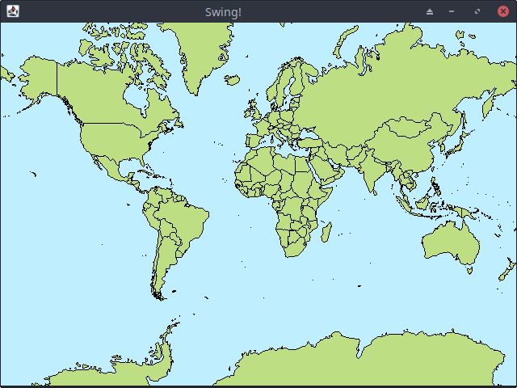

# Simple Openmap Swing example for GraalVM nativeimage

This is to demonstrate that it is possible to build a GraalVM native image from an Openmap Swing application.




### Tested on MXLinux 19.3

Requirements:

+ Java 11 GraalVM 21.1.0-dev (may work with 21.0.0)


###To build:
```sh
javac -cp lib/openmap-5.1.13.jar SwingTest.java

java -cp ".:lib/openmap-5.1.13.jar" -agentlib:native-image-agent=config-output-dir=META-INF/native-image SwingTesT

native-image -cp ".:lib/openmap-5.1.13.jar" --no-fallback --verbose -Djava.awt.headless=false SwingTest
```

###To run
```sh
./swingtest
```
